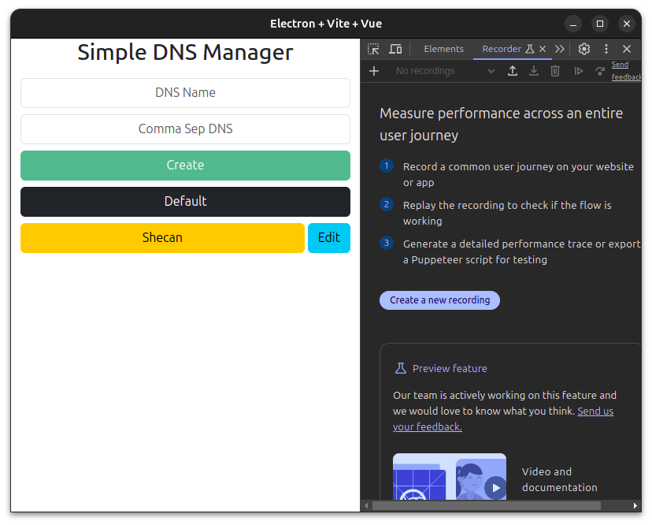

# Simple DNS Manager
With this app u can change ur linux system dns servers this app requires 
root privileges



## Quick Setup

```sh
# clone the project
git clone https://github.com/electron-vite/electron-vite-vue.git

# enter the project directory
cd electron-vite-vue

# install dependency
npm install

# develop
npm run dev
```

## Build
```sh
npm run build
```
## Debug


## Sample `.desktop` file
```.desktop
[Desktop Entry]
Version=1.0
Name=Simple DNS ChChanger
Type=Application
Exec=sh -c "pkexec env DISPLAY=$DISPLAY XAUTHORITY=$XAUTHORITY ~/dev/electron-vite-vue/release/28.1.0/Simple\ DNS\ Changer-Linux-28.1.0.AppImage --no-sandbox --disable-gpu-sandbox"
Terminal=false
StartupNotify=true
```
